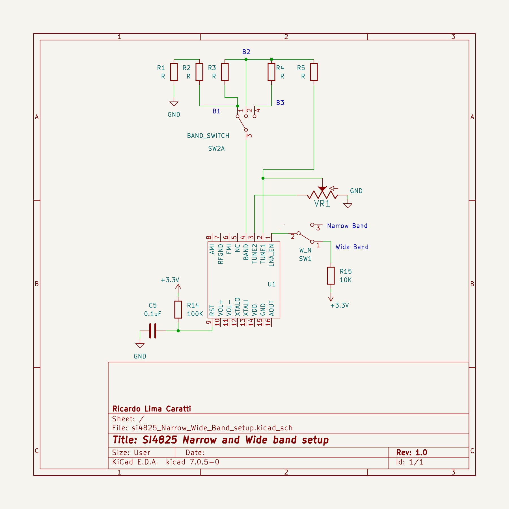
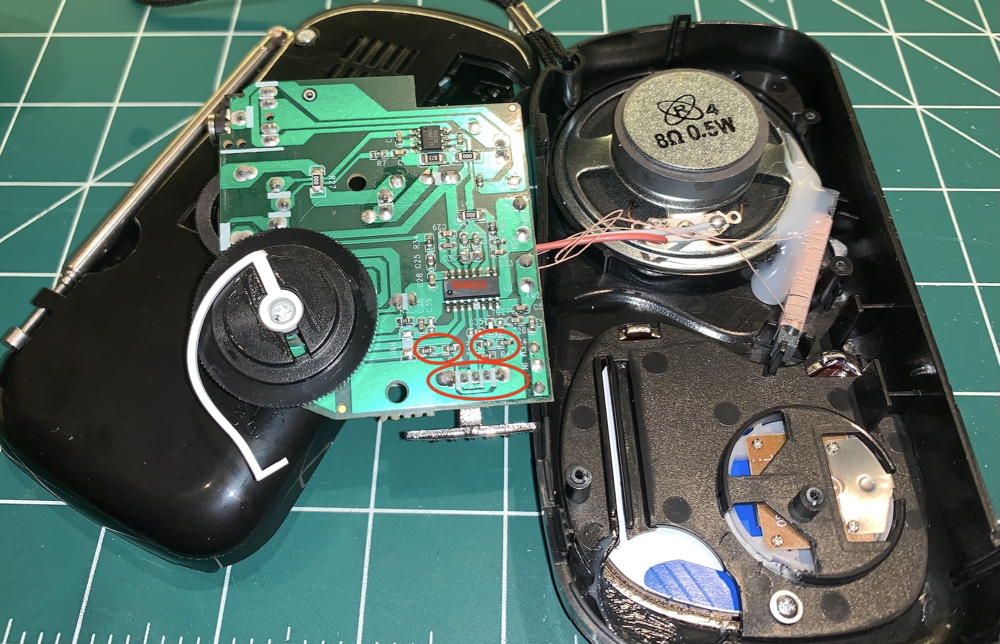
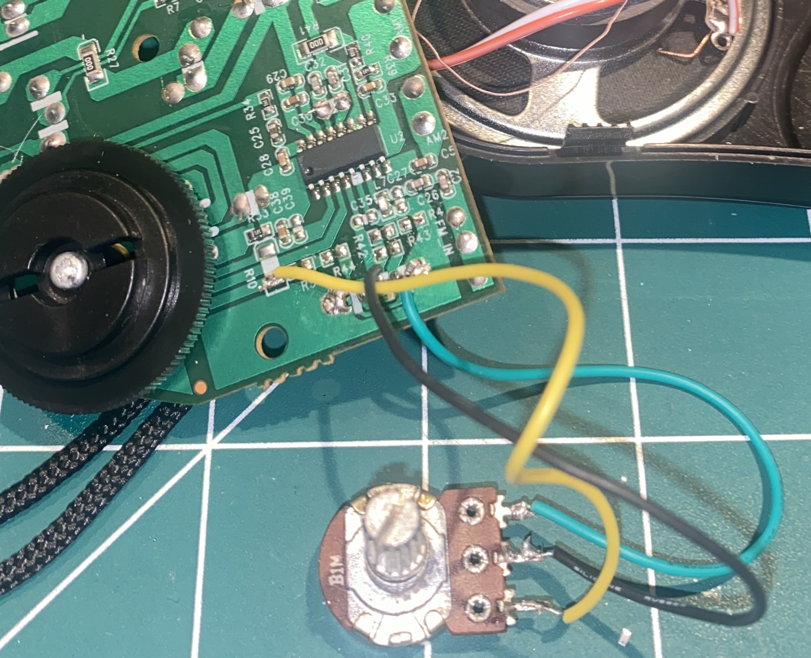

# Si4825 RADIO HACK

This project focuses on converting AM/FM radios equipped with the Si4825 DSP to enable shortwave (SW) reception. By modifying and enhancing the circuitry, it is possible to expand the functionality of these radios, allowing them to receive a broader range of frequencies.

The goal is to unlock new capabilities in receivers based on the Si4825, providing a practical and accessible way to upgrade and customize low-cost AM/FM radios for shortwave listening. This repository will serve as a guide for the construction, modification, and improvement of Si4825-based receivers, offering insights into hardware adjustments and software tweaks when applicable.

Some of the modifications presented here will suggest replacing the Si4825 with the Si4827 – essentially the same DSP, but with additional features that allow for the integration of a microcontroller such as the ATmega328 (Arduino), ESP32, ESP8266, STM32, among others.

Integrating a microcontroller into a radio project involving this DSP series can enhance the user interface by adding buttons and a display to control the receiver.

## ATTENTION

***Any modifications or interventions you make to your radio – including those equipped with the Si4825 DSP – come with the risk of causing irreparable damage. If you decide to attempt any of the procedures described in this project, please understand that you are doing so at your own risk.***

***The author of this project assumes no responsibility for any damage that may occur to your radio as a result of following the instructions or suggestions provided here.***

***Proceed with caution and ensure you are fully aware of the potential consequences before making any modifications.***

## The Si4825 pinout

To build a radio based on the Si4825 or even modify a commercial radio, it is essential to know the functions of its pins. The following figure presents the pin configuration of the Si4825.

| Pin # | Name       | Description |
| ----- | ---------- | ----------- |
| 1     | LNA_EN     | Enable SW external LNA - Wide or Narrow band - See band table |
| 2     | TUNE1      | Frequency tuning - Connected to the 100K  potentiometer | 
| 3     | TUNE2      | Frequency tuning -  Connected to the 100K  potentiometer |
| 4     | BAND       | Band selection -  connected to voltage divider  / band selector |
| 5     | NC         | No connect. Leave floating |
| 6     | FMI        | FM RF inputs. FMI should be connected to the antenna trace |
| 7     | RFGND      | RF ground. Connect to ground plane on PCB |
| 8     | AMI        | AM RF input. AMI should be connected to the AM antenna |
| 9     | RST        | Device reset (active low) input |
| 10    | VOL+       | Volume button up |
| 11    | VOL–       | Volume button down |
| 12    | XTALO      | Crystal oscillator output |
| 13    | XTALI      | Crystal oscillator input/external reference clock input |
| 14    | VDD        | Supply voltage. May be connected directly to battery |
| 15    | GND        | Ground. Connect to ground plane on PCB |
| 16    | AOUT       | Audio output |

## SI4825 BAND SETUP

The Si4825 is a basic digital AM/FM/SW radio receiver chip that uses mechanical tuning. It handles everything from the antenna input to the audio output, making it a complete radio receiver solution.

This chip is part of Silicon Laboratories' family of multi-band tuners and makes it easier to add radio reception to audio devices. It is small, requires fewer components, and offers proven, high-performance results.

The Si4825 needs only a simple circuit to work and does not require manual tuning during manufacturing. It uses Silicon Labs' patented digital low-intermediate frequency (low-IF) technology, providing good signal reception and interference rejection for AM, FM, and shortwave (SW) bands.

Because the chip is highly integrated and fully tested at the factory, it makes the design process easier, improves overall system quality, and simplifies manufacturing.

**IMPORTANT:** In some contexts within the Si4825 documentation, the acronym AM refers to Medium Wave (MW) rather than Amplitude Modulation. However, it is important to highlight that both MW and SW bands operate using Amplitude Modulation. 

### Datasheet FM band information

The Si4825 has a built-in low noise amplifier (LNA) that allows it to receive FM radio signals from 64 to 109 MHz, covering the worldwide FM broadcast band. It can also pick up TV audio stations in the same frequency range used in China.

Pre-emphasis and de-emphasis are techniques used to improve the sound quality of FM radio by reducing high-frequency noise and interference.

When an FM station transmits a signal, it boosts the high audio frequencies using a pre-emphasis filter.
On the receiving end, FM radios use a de-emphasis filter to lower those high frequencies, bringing the sound back to normal.
Different regions use different de-emphasis settings. The de-emphasis filter can have a time constant of 50 or 75 microseconds (µs), depending on the area.

## Frequency Tuning 

A valid channel can be found by adjusting a 100K potentiometer connected to the TUNE1 and TUNE2 pins of the Si4825-A10 chip. The central terminal of the potentiometer is connected to the TUNE2 pin, while the other terminals are connected to TUNE1 and ground, respectively.

This configuration allows for smooth and precise frequency tuning across the supported bands.

## Datasheet MW(AM) band information 

The Si4825-A10 is a highly integrated radio receiver that can pick up AM (MW) signals from 504 to 1750 kHz across five sub-bands. It uses digital low-IF technology, requiring very few external components and no manual tuning during production.

This technology provides precise filtering, ensuring good selectivity and signal-to-noise ratio (SNR) with minimal variation across the entire AM band. **One of the five sub-bands, called AM4 (520–1730 kHz), is designed to work globally, supporting both 9 kHz and 10 kHz channel spacing to meet different regional AM standards**.

Just like with FM signals, the Si4825-A10 enhances sensitivity and reduces interference from strong signals, making it easier to receive weaker stations.

The receiver is also flexible when it comes to antennas. It works with ferrite loop stick antennas ranging from 180 to 450 µH. If you want to use an air loop antenna, a transformer can be added to increase its inductance. By using a 1:5 turn ratio inductor, the inductance is multiplied by 25 times, making it compatible with most AM air loop antennas, which typically have inductance values between 10 and 20 µH.

## Datasheet SW(AM) information 

The Si4825 can receive signals from 36 shortwave (SW) bands ranging from 2.3 to 28.5 MHz. Of these, 18 bands are narrow meter bands, while the remaining bands cover wider frequency ranges, making them suitable for shortwave radios that operate with one or two SW bands.

The Si4825 offers extensive shortwave capabilities with the advantage of requiring minimal external components and no factory adjustments. Additionally, the FM antenna can be used to receive shortwave signals, simplifying the design and reducing the need for extra components.

### Important Considerations for Shortwave Band Configuration on the Si4825

As shown in the table below, each of the 18 shortwave (SW) bands on the Si4825 can be configured in two modes: **'Wide Band'** or **'Narrow Band'**.  

The values of the resistor network **do not need to be changed** to switch between 'Wide' and 'Narrow'. This configuration is controlled by the state of **pin 1** on the Si4825:  

- If **pin 1** is pulled up to **VCC** using a **10K resistor**, the selected band will be **'Wide'**.  
- If **pin 1** is **floating (disconnected)**, the selected band will be **'Narrow'**.  

As a result, each shortwave band can have **two possible coverage ranges**. See the table below. 

| Band Name  | Band Frequency Range       | Channel Space | AR(K) | Note               |
| ---------- | -------------------------- | --------------| ----- | ------------------ |  
|            |                            |               |       | 47K botton resistor|   
| FM1        | 87–108 MHz (50 µs)         |               |  47   |                    |             
| FM2        | 87–108 MHz (50 µs)         |               |  57   |                    | 
| FM3        | 87–108 MHz (75 µs)         |               |  67   |                    |
| FM4        | 87–108 MHz (75 µs)         |               |  77   |                    |
| FM5        | 86.5–109 MHz (50 µs)       |               |  87   |                    |
| FM6        | 86.5–109 MHz (50 µs)       |               |  97   |                    |
| FM7        | 87.3–108.25 MHz (50 µs)    |               | 107   |                    | 
| FM8        | 87.3–108.25 MHz (50 µs)    |               | 117   |                    |
| FM9        | 87.3–108.25 MHz (75 µs)    |               | 127   |                    |
| FM10       | 87.3–108.25 MHz (75 µs)    |               | 137   |                    |
| FM11       | 76–90 MHz (50 µs)          |               | 147   |                    |
| FM12       | 76–90 MHz (50 µs)          |               | 157   |                    |
| FM13       | 64–87 MHz (50 µs)          |               | 167   |                    |
| FM14       | 64–87 MHz (50 µs)          |               | 177   |                    |
| FM15       | 76–108 MHz (50 µs)         |               | 187   |                    |
| FM16       | 76–108 MHz (50 µs)         |               | 197   |                    |
| FM17       | 64–108 MHz (50 µs)         |               | 207   |                    |
| FM18       | 64–108 MHz (50 µs)         |               | 217   |                    | 
| AM1        | 520–1710 kHz               |     10k       | 227   |                    |
| AM2        | 522-1620 kHz               |      9k       | 237   |                    |
| AM3        | 504-1665 kHz               |      9k       | 247   |                    | 
| AM4        | 522-1728 kHz/520-1730 kHz  |      9k / 10k | 257   |                    |
| AM5        | 510-1750 kHz               |     10k       | 267   |                    |
| SW1-Wide   | 2.3–10.0 MHz               |      5k       | 277   | Pin 1 pulled up    | 
| SW1-Narrow | 2.30–2.49 MHz              |      5k       |       | Pin 1 **floating** |
| SW2-Wide   | 3.2–7.6 MHz                |      5k       | 287   | Pin 1 pulled up    |
| SW2-Narrow | 3.20–3.40 MHz              |      5k       |       | Pin 1 **floating** |   
| SW3-Wide   | 3.2–10.0 MHz               |      5k       | 297   | Pin 1 pulled up    |
| SW3-Narrow | 3.90–4.00 MHz              |      5k       |       | Pin 1 **floating** | 
| SW4-Wide   | 3.7–12.5 MHz               |      5k       | 307   | Pin 1 pulled up    | 
| SW4-Narrow | 4.75–5.06 MHz              |      5k       |       | Pin 1 **floating** |
| SW5-Wide   | 3.9–7.5 MHz                |      5k       | 317   | Pin 1 pulled up    |
| SW5-Narrow | 5.6–6.4 MHz                |      5k       |       | Pin 1 **floating** |   
| SW6-Wide   | 3.2–10.0 MHz               |      5k       | 327   | Pin 1 pulled up    |
| SW6-Narrow | 3.90–4.00 MHz              |      5k       |       | Pin 1 **floating** | 
| SW7-Wide   | 5.8–12.1 MHz               |      5k       | 337   | Pin 1 pulled up    | 
| SW7-Narrow | 6.8–7.6 MHz                |      5k       |       | Pin 1 **floating** |
| SW8-Wide   | 5.9–9.50 MHz               |      5k       | 347   | Pin 1 pulled up    |
| SW8-Narrow | 7.1–7.6 MHz                |      5k       |       | Pin 1 **floating** |   
| SW9-Wide   | 5.9–18.0 MHz               |      5k       | 357   | Pin 1 pulled up    |
| SW9-Narrow | 9.2–10 MHz                 |      5k       |       | Pin 1 **floating** | 
| SW10-Wide  | 7.0–16.0 MHz               |      5k       | 367   | Pin 1 pulled up    | 
| SW10-Narrow| 11.45–12.25 MHz            |      5k       |       | Pin 1 **floating** |
| SW11-Wide  | 7.0–23.0 MHz               |      5k       | 377   | Pin 1 pulled up    |
| SW11-Narrow| 11.6–12.2 MHz              |      5k       |       | Pin 1 **floating** |   
| SW12-Wide  | 9.0–16.0 MHz               |      5k       | 387   | Pin 1 pulled up    |
| SW12-Narrow| 13.4–14.2 MHz              |      5k       |       | Pin 1 **floating** | 
| SW13-Wide  | 9.0–22.0 MHz               |      5k       | 397   | Pin 1 pulled up    | 
| SW13-Narrow| 13.57–13.87 MHz            |      5k       |       | Pin 1 **floating** |
| SW14-Wide  | 9.5–18.0 MHz               |      5k       | 407   | Pin 1 pulled up    |
| SW14-Narrow| 15 –15.9 MHz               |      5k       |       | Pin 1 **floating** |   
| SW15-Wide  | 10.0–16.0 MHz              |      5k       | 417   | Pin 1 pulled up    |
| SW15-Narrow| 17.1 –18 MHz               |      5k       |       | Pin 1 **floating** | 
| SW16-Wide  | 10.0–22.0 MHz              |      5k       | 427   | Pin 1 pulled up    | 
| SW16-Narrow| 17.48–17.9 MHz             |      5k       |       | Pin 1 **floating** |
| SW17-Wide  | 13.0–18.0 MHz              |      5k       | 437   | Pin 1 pulled up    |
| SW17-Narrow| 21.2–22 MHz                |      5k       |       | Pin 1 **floating** |   
| SW18-Wide  | 18.0–28.5 MHz              |      5k       | 447   | Pin 1 pulled up    |
| SW18-Narrow| 21.45–21.85 MHz            |      5k       |       | Pin 1 **floating** | 
|            |                            |               | 500   | 53K top resistor   |       

#### About the Previous Table:

* The **Botton Resistor** (first line - connected to GND) represents the minimum resistance required to reach the first band (FM1). 
* The **Top Resistor** (last line - connected to TUNE1) is the value needed to complete a total of 500K. Hypothetically, if you use all the bands described in the table, you should use a 53K resistor.
* AR(K) is the value of the accumulated resistance required to select the desired band. For example: Consider that the receiver you are designing only includes the SW 10 band. The value of the first resistor (top resistor) should be 367K, and the value of the second resistor (bottom resistor) should be 133K (500 - 367). The common point between the two resistors must be connected to pin 4 of the Si4825 (BAND).
* Pay attention to the SW bands and observe the Wide and Narrow configurations. The resistance value required to select the band does not change. The Wide or Narrow configuration is determined by pin 1 of the Si4825, as previously described.

#### About Narrow and Wide band setup

The Si4825 allows configuration between Wide Band and Narrow Band through pin 1 (LNA_EN). Frequency coverage for Wide and Narrow Band is detailed in the previous table.

In general, Wide Band is recommended when the goal is to provide the user with a broad frequency range, with limited band selection options on the receiver. While this approach allows for shortwave reception over a wide range, it can make locating and tuning to a specific station more challenging. To configure the receiver for Wide Band, simply add a 10kΩ pull-up resistor to the LNA_EN pin.

Conversely, if the radio design includes a multi-position band selection switch (six or more positions, for example), Narrow Band configuration may be more suitable. This option offers narrower coverage bands, providing a more precise tuning experience and making it easier to locate a specific station. For this configuration, the LNA_EN pin should be left floating (unconnected).

It is also possible to implement both options in the same design. To achieve this, add a switch that, when turned on, connects the pull-up resistor to the LNA_EN pin, and when turned off, leaves the pin floating.

***Note: Changing the state of this switch does not immediately alter the configuration from Wide to Narrow (or vice-versa). For the change to take effect, the Si4825 must be reset or power-cycled.***

The circuit below shows the Narrow and Wide Band setup.  

#### Si4825 Band setup Example

The following example illustrates the band configuration for a hypothetical 12-band radio, one FM band, one MW(AM) band, and 10 SW bands. Observe in the circuit the indication of the band name (according to the previous table), the applied resistors, and the accumulated resistance value. It is important to highlight that for this hypothetical project, pin 1 of the Si4825 is not in the pull-up configuration. Thus, all selected SW bands will be 'Narrow'.

## Examplo 1 - Modifying a Low-Cost AM/FM Radio to Receive Shortwave

In this example, a small modification will be made to a low-cost radio (priced at $5 or less), based on the Si4825, with only two band options (AM/MW and FM). The image below shows the radio.

The image below shows the radio opened, with the top part of the circuit board featuring very few components – a characteristic of DSP-based receivers, including the Si4825.

The image below shows the bottom part of the circuit board, where the DSP Integrated Circuit (likely the Si4825) can be located. Why "likely"? Well, it is common for receivers with the same appearance to be equipped with other DSPs competing with the Si4825.

To confirm that it is indeed the Si4825, it is necessary to identify the connections between the IC and the tuning potentiometer (pins 2 and 3), the band selection pin (pin 4), the pins where the crystal is connected (pins 12 and 13), the AM antenna (pin 8 - AMI), and the FM antenna (pin 6 - FMI). It is unlikely that an IC from another manufacturer will have the same pin configuration.

In the figure below, note the red highlights. These indicate the points where the modification will be made. Essentially, the modification involves removing the resistors responsible for selecting the AM and FM bands.

Notice that there is a two-position switch that allows for this selection. The center point of the switch is connected to pin 4 of the IC, indicating that it is a Si4825. To confirm, observe the connections to the tuning potentiometer.

In a closer view, note that the IC has been scraped by the manufacturer. This highlights the importance of knowing the Si4825 pin configuration as well as understanding the connections of external components to the IC.

In the image below, note the red highlights indicating the removal of the original band selection resistors, as well as the removal of the original band switch.

***Note: Depending on the modification to be made, removing the original switch may not be necessary.***

The figure below shows the new "band selector" for the radio. In reality, it is a 1M potentiometer, but ideally, it should be a 500K potentiometer.

Remember that, as previously mentioned, the resistor network (voltage divider) for band selection should be 500K, according to the manufacturer. Since it is a voltage divider, using a 1M potentiometer for this purpose did not seem to cause any issues.

In the configuration shown in the image, the receiver will cover all the Narrow bands available on the Si4825.

The challenge with this approach – using a variable resistor instead of a band switch – is that locating the desired band becomes more difficult, as there is no precise indication of the resistance or the voltage divider result on the potentiometer. However, with experience using the radio in this configuration, it becomes easier to find a particular band and, consequently, a shortwave station.

The figure below illustrates the final result of the modification. There is a [video on YouTube](https://youtu.be/3q1Z5tCHIJM?si=PKrBP-vTaTvmAvGj) (in Portuguese) that showcases some shortwave receptions using this radio. Link to the vídeo: https://youtu.be/3q1Z5tCHIJM?si=PKrBP-vTaTvmAvGj

## References 

* BROADCAST MECHANICAL TUNING AM/FM/SW RADIO RECEIVER (Si4825-A10)
* SKYWORKS -  Si4825 DEMO BOARD USER’S GUIDE (Si4825-DEMO)