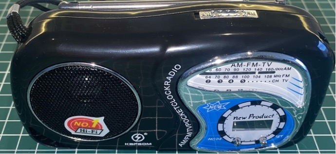
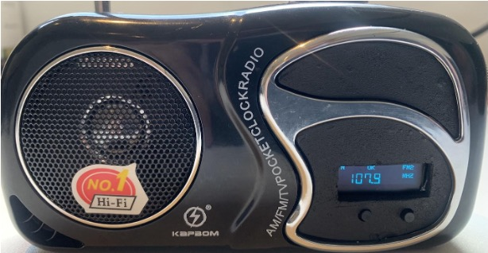
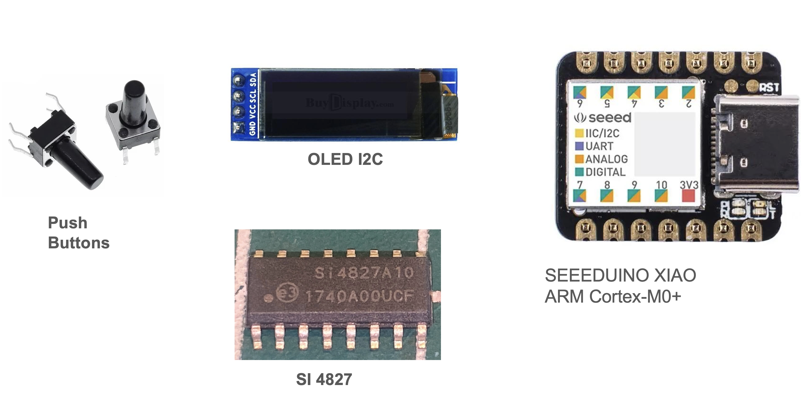

# Converting a Low-Cost Radio Based on the Si4825 into a Digital Interface Radio Using the Si4827

## Radio original

## Modified Radio 

## About the Low-Cost Radio (KapBom K2019)

- Two bands (MW and FM)
- Less than $5
- Compact and lightweight
- Based on the Si4825 DSP
- Sturdy plastic casing
- Analog interface

**Warning:** There are other receivers from different manufacturers that use the same casing but are not equipped with the Si4825. Be sure the receiver is equipped with the Si4825.

*Comment:* This slide introduces the KapBom K2019 radio, highlighting its affordability and compact design. 

## About the Modified Radio

- 15 bands (3 FM, 2 AM, and 10 SW)
- Bands can be configured via programming
- Based on the Si4827 DSP
- Uses the Seeeduino XIAO controller (ARM Cortex-M0+)

*Comment:* The modifications allow for significantly expanded band coverage and digital control. 

## Components Used for the Modification

- SEEEDUINO XIAO (ARM Cortex-M0+)
- OLED I2C
- SI4827
- Push Buttons

*Comment:* The list of components required for upgrading the radio with digital controls. 

## About the DSP Si4825

- Support for FM band (64–109 MHz)
- Support for AM band (504–1750 kHz)
- Support for SW band (2.3–28.5 MHz)
- No manual calibration required
- Mono audio output
- Band configuration according to region (AM/FM/SW)
- Enhanced coverage for FM/SW bands

*Comment:* Basic features of the Si4825 DSP, focusing on analog control and limited customization. 

## About the DSP Si4827

- Support for FM band (64–109 MHz)
- Support for AM band (504–1750 kHz)
- Support for SW band (2.3–28.5 MHz)
- Selectable support for all regional AM/FM/SW bands
- Enhanced coverage of FM/SW bands
- 2-wire control interface (I2C)
- Valid station indicator
- Support for digital volume control
- Support for bass and treble adjustment

*Comment:* The Si4827 introduces significant improvements, including I2C control and digital enhancements. 

## Modification Steps

### Open Radio (Before Modification)

*Comment:* This step involves opening the radio and inspecting the internal components. 

### Board (Before Modification)

*Comment:* The PCB layout before modifications are applied. 

### Si4825 Identification (Check if the Radio is Based on Si4825)

*Comment:* Ensure the radio is equipped with the Si4825 before proceeding with modifications. 

### Replacement of Si4825 with Si4827

*Comment:* Carefully desolder and replace the Si4825 with the Si4827. 

### Si4827 Soldered on the Board

*Comment:* The Si4827 must be securely soldered, ensuring proper connectivity. 

### Si4827 with a Cut on the Trace Leading to Pin 4 (BAND)

*Comment:* A necessary modification to allow software-controlled band selection. 

## Si4827 and Seeduino XIAO Wireup

| SI4827 Pin | SEEEDUINO Pin | Description                  |
|------------|--------------|------------------------------|
| 1          | 2            | SEEEDUINO Interrupt Pin      |
| 9          | 6            | RESET                        |
| 10         | A4 (SDA)     | I2C Bus (Data)               |
| 11         | A5 (SCL)     | I2C Bus (Clock)              |

*Comment:* Pin mappings for interfacing the Si4827 with Seeeduino XIAO. 

### OLED Wiring
| OLED Pin  | SEEEDUINO Pin | Description     |
|-----------|--------------|-----------------|
| SDA       | 4            | I2C Bus (Data)  |
| CLK       | 5            | I2C Bus (Clock) |

*Comment:* The OLED display connects via the I2C bus for visual feedback. 

### Push Buttons Wiring
| Button    | SEEEDUINO Pin | Function       |
|-----------|--------------|---------------|
| BAND UP   | 7            | Next Band     |
| BAND DOWN | 8            | Previous Band |

*Comment:* Buttons allow manual band switching when using the digital interface. 

## Checking the Si4827 and Seeduino XIAO Setup

*Comment:* Ensure all components are wired correctly before powering on. 

## Case Modification
### Case Modification Process

*Comment:* Adjust the radio casing to accommodate the new components. 

## Finish

*Comment:* Final testing and verification of the modified radio.
