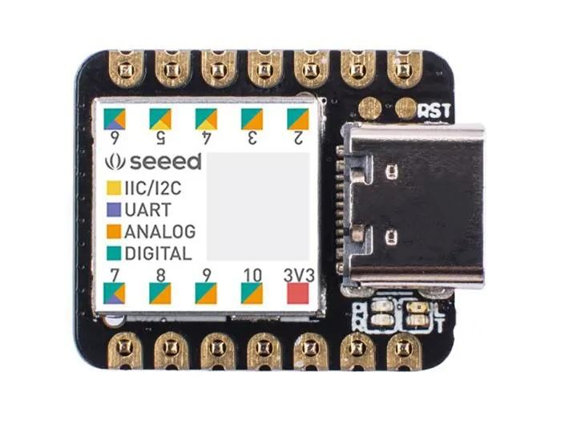
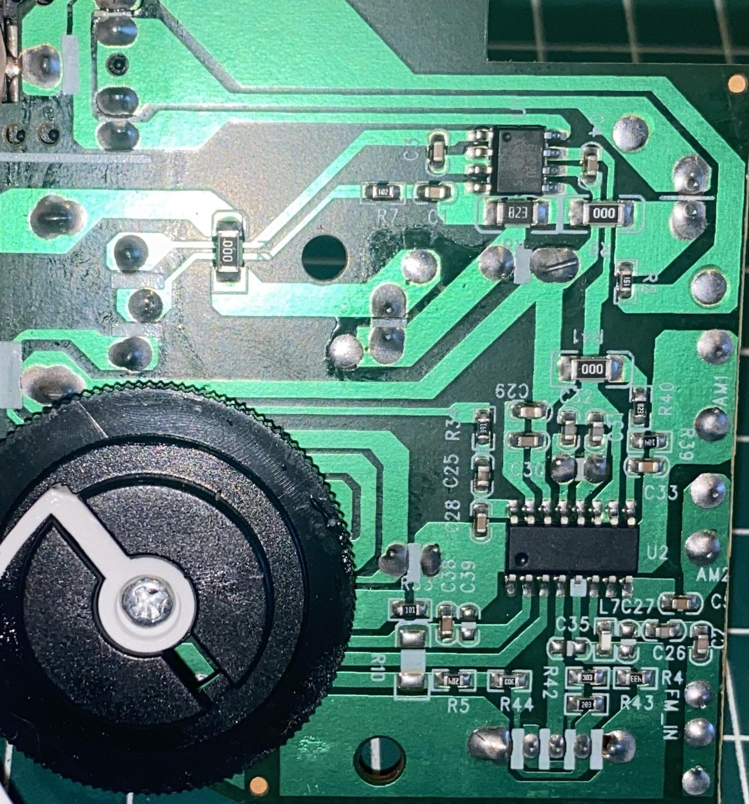
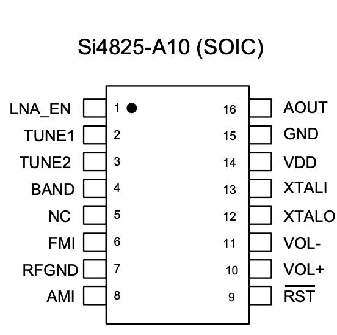

# Converting Si4825 to Si4827 with Digital Interface

## Slide 1

### Converting a low-cost radio based on the Si4825 into a digital interface radio using the Si4827.

---

## Slide 2 — About the low-cost radio (KapBom K2019)

- Two bands (MW and FM)
- Less than $5
- Compact and lightweight
- Based on the Si4825 DSP
- Sturdy plastic casing
- Analog interface

- Warning: There are other receivers from different manufacturers that use the same casing but are not equipped with the Si4825. Be sure the receiver is equipped with the Si4825.

---

## Slide 3 — About the modified radio

- 15 bands (3 FM, 2 AM, and 10 SW)
- Bands can be configured via programming
- Based on the Si4827 DSP
- Uses the Seeeduino XIAO controller (ARM Cortex-M0+)

---

## Slide 4 — Components used for the modification

- Seeeduino XIAO (ARM Cortex-M0+)
- OLED (I2C)
- Si4827
- Push Buttons

---

## Slide 5 — About the DSP Si4825

- Support for FM band (64–109 MHz)
- Support for AM band (504–1750 kHz)
- Support for SW band (2.3–28.5 MHz)
- No manual calibration required
- Mono audio output
- Band configuration according to region (AM/FM/SW)
- Enhanced coverage for FM/SW bands

---

## Slide 6 — About the DSP Si4827

- Support for FM band (64–109 MHz)
- Support for AM band (504–1750 kHz)
- Support for SW band (2.3–28.5 MHz)
- Selectable support for all regional AM/FM/SW bands
- Enhanced coverage of FM/SW bands
- 2-wire control interface (I2C)
- Valid station indicator
- Support for digital volume control
- Support for bass and treble adjustment

---

## Slides 7–12 — Disassembly, board, replacement, and photos

These slides show the radio opened, the board before modification, identification of the Si4825, replacement steps, and photos of the Si4827 soldered and the trace cut on pin 4 (BAND).

---

## Slide 13 — Wiring (Si4827 and Seeeduino XIAO)

| Si4827 pin | Seeeduino pin | Description            |
|------------|---------------|------------------------|
| 1          | 2             | Seeeduino interrupt pin|
| 9          | 6             | RESET                  |
| 10         | A4 (SDA)      | I2C bus (Data)         |
| 11         | A5 (SCL)      | I2C bus (Clock)        |

### OLED wiring

| OLED pin | Seeeduino pin | Description     |
|----------|---------------|-----------------|
| SDA      | 4             | I2C Bus (Data)  |
| CLK      | 5             | I2C Bus (Clock) |

### Push buttons wiring

| Button    | Seeeduino pin | Function       |
|-----------|---------------|----------------|
| BAND UP   | 7             | Next Band      |
| BAND DOWN | 8             | Previous Band  |

---

## Slide 14 — Checking the Si4827 and Seeeduino XIAO setup

---

## Slides 15–16 — Case modification

---

## Slide 17 — Finish

---
# Modificando de Si4825 para Si4827 com interface Digital

## Slide 1

### Converting a low-cost radio based on the Si4825 into a digital interface radio using the Si4827.

---

## Slide 2

### About the low-cost radio (KapBom K2019)

- Two bands (MW and FM)

- Less than $5

- Compact and lightweight

- Based on the Si4825 DSP

- Sturdy plastic casing

- Analog interface

- Warning: There are other receivers from different manufacturers that use the same casing but are not

- equipped with the Si4825. Be sure the receiver is equipped with the Si4825.

---

## Slide 3

### About the modified radio

- 15 bands (3 FM, 2 AM, and 10 SW)

- Bands can be configured via programming

- Based on the Si4827 DSP

- Uses the Seeeduino XIAO controller (ARM Cortex-M0+)

---

## Slide 4

### Components used for the modification

- SEEEDUINO XIAO

- ARM Cortex-M0+

OLED I2C

SI 4827

Push Buttons

---

## Slide 5

### About the DSP Si4825

- Support for FM band (64–109 MHz)

- Support for AM band (504–1750 kHz)

- Support for SW band (2.3–28.5 MHz)

- No manual calibration required

- Mono audio output

- Band configuration according to region (AM/FM/SW)

- Enhanced coverage for FM/SW bands

---

## Slide 6

### About the  DSP Si4827

- Support for FM band (64–109 MHz)

- Support for AM band (504–1750 kHz)

- Support for SW band (2.3–28.5 MHz)

- Selectable support for all regional AM/FM/SW bands

- Enhanced coverage of FM/SW bands

- 2-wire control interface (I2C)

- Valid station indicator

- Support for digital volume control

- Support for bass and treble adjustment

---

## Slide 7

### Open radio (before modification)

---

## Slide 8

### Board (before modification)

---

## Slide 9

### Si4825 Identification (Check if the radio is based on Si4825)

---

## Slide 10

### Replacement of Si4825 with Si4827

---

## Slide 11

### Si4827 soldered on the board

---

## Slide 12

### Si4827 with a cut on the trace leading to pin 4 (BAND)

---

## Slide 13

### Si4827 and Seeduino XIAO wireup

- | SI4827 pin | SEEEDUINO pin |  Description                |

- | ---------  | ------------  | ----------------------------|

- |    1       |  2            | SEEEDUINO interrupt pin     |

- |    9       |  6            | RESET                       |

- |   10       |  A4 (SDA)     | I2C bus (Data)              |

- |   11       |  A5 (SCL)     | I2C bus (Clock)             |

- | -----------| ------------- | ----------------------------|

- |  OLED      |               |                             |

- | -----------| ------------- | ----------------------------|

- |   SDA      |  4            | I2C Bus (Data)              |

- |   CLK      |  5            | I2C bus (CLock)             |

- | -----------| ------------- | ----------------------------|

- |Push Buttons|               |                             |

- | -----------| ------------- | ----------------------------|

- |  BAND UP   |  7            | Next Band.                  |

- |  BAND DOWN |  8            | Previous Band               |

---

## Slide 14

### Checking the Si4827 and Seeduino XIAO setup

---

## Slide 15

### Case modification

---

## Slide 16

### Case modification

---

## Slide 17

### Finish

---
