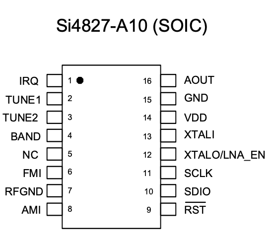
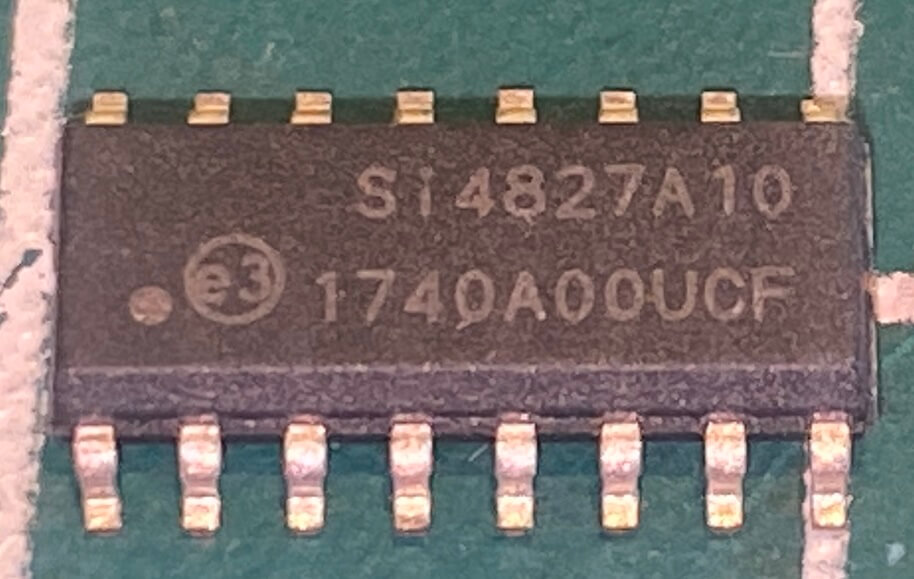

# Modificando o rádio da KapBom-KA3196

## Slide 1

### Convertendo rádio KAPBOM - KA-3196, baseado no DSP Si4825, em um rádio com interface digital utilizando o DSP Si4827.

# Modifying the KapBom KA3196 Radio

## Slide 1

### Converting the KAPBOM KA-3196 radio (based on the Si4825 DSP) into a radio with a digital interface using the Si4827 DSP.

---

## Slide 2

### About the KapBom KA3196 Radio (Original)

- Price: R$60.00 to R$90.00

- 9 bands (FM, AM and 7 SW)

- Shortwave coverage: 62m, 49m, 41m, 31m, 16m and 13m

- RF signal amplifier for SW

- Analog dial

- Based on the Si4825 DSP

- Good sound quality

- Classic vintage radio design

- Rechargeable battery (USB) and optional two D-size cells

- No extended FM

- No 25m SW band (11,600 to 12,200 kHz)

- No accessories (radio only)

---

## Slide 3

### About the KapBom KA3196 Radio (Modified)

- Retains all basic features of the original radio

- 19 bands (2 FM, 2 AM and 15 SW)

- Shortwave coverage: 10m–90m (15 bands)

- User can enable or disable the RF signal amplifier

- Analog and digital dial

- Based on the Si4827 DSP

- Tuned station indicator

- Indicator showing match between analog dial and digital display

- RF amplifier enabled indicator

---

## Slide 4

### Original radio opened

---

## Slide 5

### Replacement of Si4825 with Si4827

---

## Slide 6

### Si4825 vs Si4827 DSP

---

## Slide 7

### KapBom radio PCB with Si4825

---

## Slide 8

### Removal of Si4825

---

## Slide 9

### Preparation for Si4827

---

## Slide 10

### Signal amplifier

---

## Slide 11

### Components for the modification

- TM1637 7-seg display

- Si4827

- Push buttons

- LEDs

- LGT8F328

- Compatible with Arduino Pro Mini

---

## Slide 12

### Connections of components to Arduino / LGT8F328

---

## Slide 13

---

## Slide 14

---

## Slide 15

### Modification completed

---

##  Arduino and Si4827 pin connections
| SI4827 pin | Arduino pin   |  Description                                       |
| ---------  | ------------  | -------------------------------------------------  |
|    1       |  D2           | Arduino interrupt pin                              |
|    9       |  D12          | RESET                                              |
|   10       |  A4/D4 (SDA)  | I2C bus (Data)                                     |
|   11       |  A5/D5 (SCL)  | I2C bus (Clock)                                    | 
| -----------| ------------- | ---------------------------------------------------|
|  TM1637    |               |  7 Seg. Display based on TM1637                    |
| -----------| ------------- | ---------------------------------------------------|                        
|   Data     |  5            |                                                    |
|   CLOCK    |  6            |                                                    |       
| -----------| ------------- | ---------------------------------------------------|
|Push Buttons|               |                                                    |
| -----------| ------------- | ---------------------------------------------------| 
|  BAND_UP   |     7         | Next Band                                          |                          
|  BAND_DOWN |     8         | Previous Band                                      | 
|  SW LNA_EN |     9         | Enable/Disable LNA for Shortwave                   | 
| -----------| ------------- | ---------------------------------------------------| 
|  LEDs      |               |                                                    |
| -----------| ------------- | ---------------------------------------------------| 
|  DIAL      |     3        | Indicates that the analog dial shows the current frequency, matching the one displayed on the screen |
|  TUNE      |     4         | Indicates that the receiver is tuned in a valid channel |
|  LNA EN    |    10         | Shares the same Arduino/LGT pin 9 to indicate that the LNA is enabled |