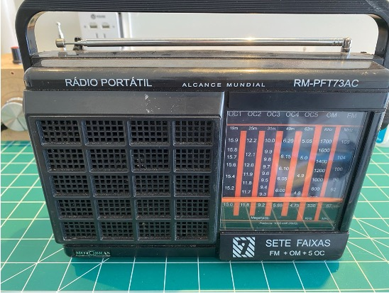
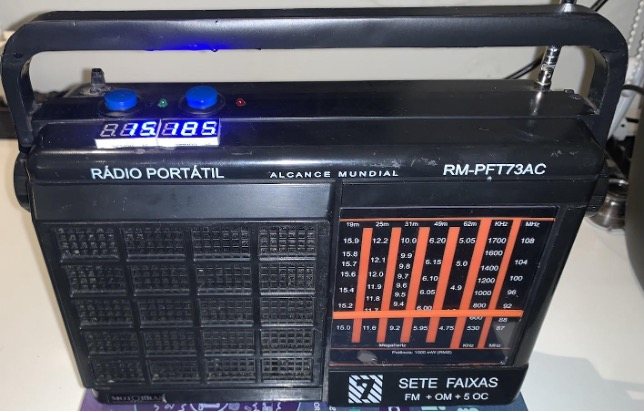
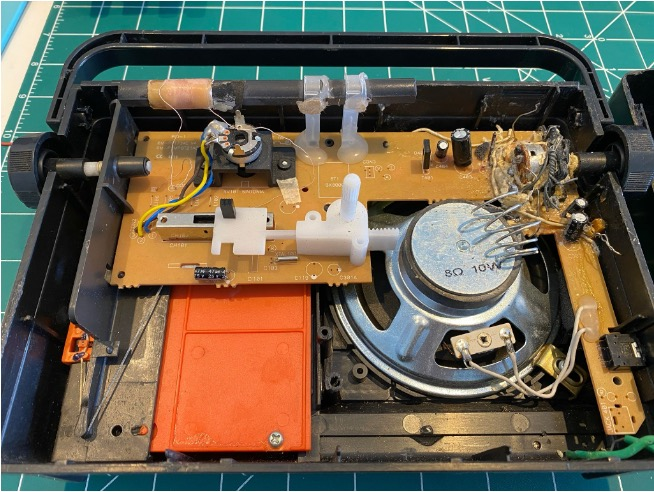
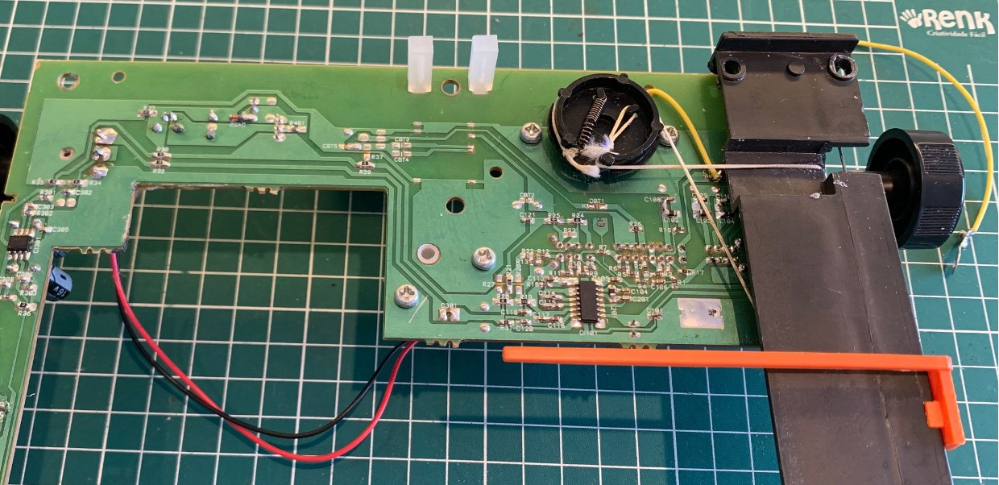
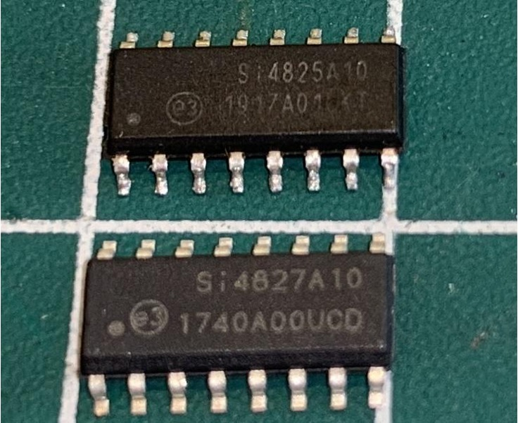

# Converting the Motobras RM-PFT73AC Radio (Si4825) into a Digital Interface Radio (Si4827)

## About the Motobras RM-PFT73AC Radio (Original)

- 7 Bands (FM, AM, and 5 SW bands)
- Analog dial
- Based on the Si4825 DSP
- Good sound quality
- Follows the classic model of old radios
- SW coverage: 62m, 49m, 31m, 25m, and 19m

## About the Modified Motobras RM-PFT73AC Radio

This radio was obtained from scrap. It is a receiver manufactured in Brazil. As seen in the image below, it arrived heavily damaged, requiring partial restoration before proceeding with the modification.

- 19 Bands (2 FM, 2 AM, and 15 SW)
- Analog and Digital Dial
- Based on the Si4827 DSP
- Tuned Station Indicator
- Indicator when the Analog Dial does not correspond to the current band
- Uses the same RF front-end and audio circuit as the original radio
- SW coverage: 10m - 90m (15 bands)

## Modification Steps

Fortunately, except for the audio output and control stage, the PCB was in good condition. To perform the partial restoration of the radio, it was enough to replace the volume potentiometer as well as some components near it.

### Original Radio Opened (Scrap Unit)

### Motobras RM-PFT73AC Board with Si4825

### Si4825 Soldered on the Radio Board detail

### Replacement of Si4825 with Si4827

### DSP Si4825 vs. Si4827

## Components for the Modification

- **SEEEDUINO XIAO (ARM Cortex-M0+)**
  - Flash Memory: 256 KB
  - RAM: 32 KB
- **TM1637 7-Segment Display**
- **SI4827 DSP**
- **Push Buttons**
- **LEDs**

### Connections of Components with Seeeduino XIAO

## Removing the Si4825 from the Board and Modifications
- Cutting PCB traces and removing the Reset Resistor and Capacitor

## Si4827 Soldered on the Board and Connections with Seeeduino
### Si4827 Soldered on the Board and Wiring

## Finalized Modification

